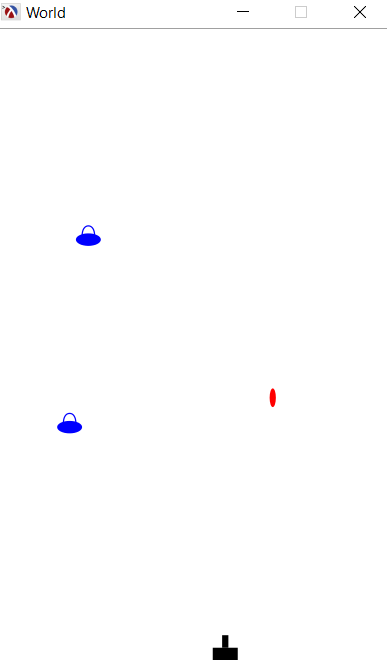

# The following snippets are included with this repository:

## Simple Algorithms
The scheme folder contains several algorithms implemented in scheme.

## Space Invaders game
This game replicates a classic arcade game. The tank moves right and left at the bottom of the screen when you press the arrow keys.
The tank fires missiles straight up from its current position when you press the space bar.
Invaders appear randomly along the top of the screen and move at a 45 degree angle.
When they hit a wall they will bounce off and continue at a 45 degree angle in the other direction.
When an invader reaches the bottom of the screen, the game is over.

The zip file is a compiled version of the game under Windows. The game was tested using the Racket language version 6.9

